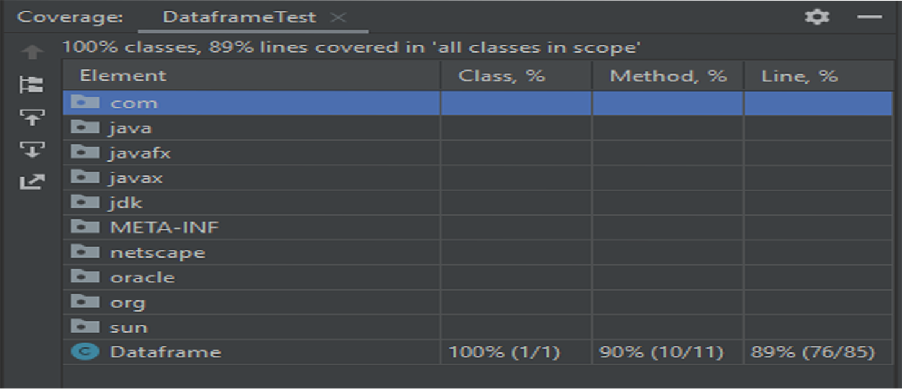
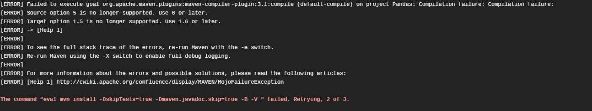

# Pandas

Prat Gary

##Fonctionalite
Pour les details de fonctionnement voire la JavaDoc dons le dossier doc.
###1. Dataframe
Pour cette partie, plusieurs constructeurs on était fait. Mais le constructeur prenant en entre un fichier CSV n'a pas était fait.
###2. Affichage d'un dataframe
Les 3 type d'affichages ont etaient realise.

###3. Selection dans un dataframe
Cette partie a était realisé même si elle n'était pas requis.

###4. Statistique sur un dataframe
Pour cette partie j'ai realisé 3 fonction (Moyenne, Min,Max).

##Outil utilise
Pour ce projet j'ai utilise L'IDE Intellij IDEA. Maven a d'ailleurs était cree avec les fonctionnalités de mon IDE.
Il en est de même pour les testes unitaire qui utilise JUNIT 5.4

Je n'ai malheuresement pas pu utiliser Travis CI à
cause d'une erreur que je n'ai su resoudre.
Pour le converage, j'ai donc utilise l'outil de coverage integre 
a intellij.
Voici une capture d'écran de l'analyse.

Je met en annexe une capture d'ecran de l'erreur, 
si vous avez le temps de regarder et que vous en connaisez la souce.

Pour la documentation, j'ai utiliser JavaDoc. Vous pouvez la trouvez dans le dossier Doc.

##Feedback
Avant tout je tiens à dire que j'ai ecrit le code et la documentation sur un ordinateur avec en clavier anglais.
Il mettait impossible d'ecrire les accents dans le code.

C'etait un projet très plaisant à faire, et 
même le projet le plus interresant que l'on nous a
donné en master pour le moment.
Il aurait peut-être été plus intéressant de nous faire travailler sur un plus gros projet, avec un groupe plus gros. (Faire toutes la bibliothèque en groupe de 5 par exemple).

##Annexe
Erreur Travis CI

